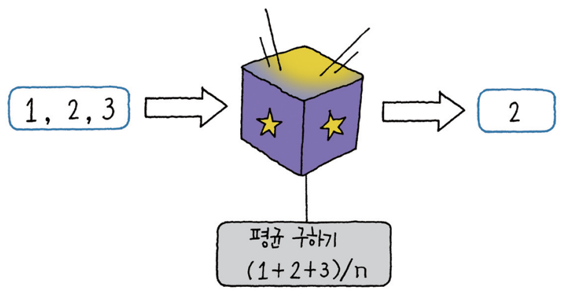
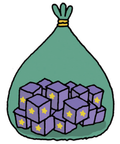
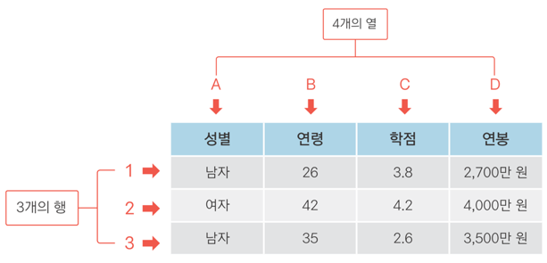

doitR/gangbuk/sep-2017/chapter03\_04
================

<br>

Chapter3. 데이터분석을 위한 연장 챙기기 <br>
--------------------------------------------

<br>

### 03-1. 변수 만들기

<br>

#### &gt; 변수 'a'에 '1'이라는 값을 할당한다! <br>


<p>
<br>

#### &gt; 아래의 코드를 입력하고 실행해보세요~ <br>

``` r
# 함수의 결과를 새 변수에 담기

x <- 1:100

mean(x)

x_mean <- mean(x)
x_mean

str5_paste <- paste(str5, collapse = " ")
str5_paste
```

``` r
a <- 1   # a에 1을 할당하라
```

<br>

#### &gt; 반응이 없다?

``` r
a    # a를 보여줘
```

<br>

#### &gt; 또는

``` r
print(a)    
```

<br>

#### &gt; quiz! : 출력된 \[1\] 1에서 '\[1\]'은 어떤 의미일까요?

``` r
#
```

<br>

#### &gt; 아래의 코드를 입력하고 실행해보세요~

``` r
a <- 1
b <- 2
c <- 3

a+b
a+b+c
4/b
5*b
```

<p>
<br>

#### &gt; `변수명은 영문으로 시작` <br> &gt; `대소문자 구분`<br> &gt; `숫자/ -/ _ 의 조합가능`<br> &gt; `한글명은 지양` <br>

<p>
<br>

### &gt; 여러개의 값으로 구성된 변수 만들기 <br>

#### &gt; 아래의 코드를 입력하고 실행해보세요~ <br>

``` r
# c = combine 

var1 <- c(1,2,5,7,8)     # temp <- 1,2,3,4,5     이렇게 입력하면?
var1

var2 <- c(1:5)           # temp <- 1:5     이렇게 입력하면?
var2

var3 <- seq(1, 5)        # temp <- c(seq(1,5))     이렇게 입력하면?
var3

var4 <- seq(1, 10, by=2)
var4

var1
var1 + 2

var1                     # 조금전에 'var1 + 2'을 했었는데 왜 var1의 값은 변하지 않고 그대로일까?
var2
var1 + var2
```

<br>

#### &gt; quiz! : 아래 코드를 실행하면 어떻게 될까요? <br>

``` r
temp1 <- c(1,2)
temp2 <- c(1,1,1,1,1)

temp1 + temp2
```

<p>
<br>

#### &gt; quiz! : 아래 코드를 실행하면 어떻게 될까요? <br>

``` r
temp3 <- rep(1, 5)
```

<br>

#### &gt; 문자로 된 변수만들기 <br>

#### &gt; 아래의 코드를 입력하고 실행해보세요~ <br>

``` r
srt1 <- 'a'             # ''와 ""는 동일
str1

str2 <- 'text'
str2

str3 <- 'hello world'
str3

b <- 1; c <- '1'
b; c                  # 무엇이 다를까요?
```

<br>

#### &gt; 어떻게 될까요? <br>

``` r
str1 <- 'a'             # str <- a 라고 하시면 안됩니다. 왜?

str1 + 1                # 어떻게 될까요?
```

<p>
<br>

### 03-2. 함수 이해하기

<p>
<br>

#### &gt; '평균을 구하는 함수'에 데이터를 지정하면 평균이 계산되어 나온다 <br>


<p>
<br>

#### &gt; 아래의 코드를 입력하고 실행해보세요~ <br>

``` r
x <- c(1,2,3)              # 연속된 숫자 1,2,3을 입력하는 다른 방법은?
x

mean(x)
max(x)
min(x)
sum(x)

x
```

<br>

#### &gt; 아래의 코드를 입력하고 실행해보세요~ <br>

``` r
str5 <- c('Hello!', 'World', 'is', 'good!')
str5

paste(str5, collapse = ',')   # 쉼표로 구분된 str5의 단어들 하나로 합치기

paste(str5, collapse = ' ') 
```

<br>

#### &gt; 아래의 코드를 입력하고 실행해보세요~ <br>

``` r
# 함수의 결과를 새 변수에 담기

x <- 1:100

mean(x)

x_mean <- mean(x)
x_mean

str5_paste <- paste(str5, collapse = " ")
str5_paste
```

<br>

03-3. 함수 꾸러미, 패키지 이해하기 <br>
---------------------------------------

<br>

#### &gt; 패키지 : 함수가 여러 개 들어 있는 꾸러미 <br>

<p>
<br>

<p>
<br>

#### &gt; ggplot2 패키지 설치하기, 로드하기 <br>

``` r
# 함수의 결과를 새 변수에 담기

install.packages("ggplot2")  # ggplot2 패키지 설치

library(ggplot2)             # ggplot2 패키지 로드
```

<br>

#### &gt; 아래의 코드를 입력하고 실행해보세요~ <br>

``` r
# 여러 문자로 구성된 변수 생성
x <- c("a", "a", "b", "c")
x

# 빈도 그래프 출력
qplot(x)

# 
data("mpg")
str(mpg)
help(mpg)

# data에 mpg, x축에 hwy 변수 지정하여 그래프 생성
qplot(data = mpg, x = hwy)       

# x축 cty
qplot(data = mpg, x = cty)

# qplot(data = mpg, x = hwy, bins = 10)   # 그래프가 어떻게 그려질까요?
# qplot(data = mpg, x = hwy, binwidth = 1)   # 그래프가 어떻게 그려질까요?

# x축 drv, y축 hwy
qplot(data = mpg, x = drv, y = hwy)

# x축 drv, y축 hwy, 선 그래프 형태
qplot(data = mpg, x = drv, y = hwy, geom = "line")

# x축 drv, y축 hwy, 상자 그림 형태
qplot(data = mpg, x = drv, y = hwy, geom = "boxplot")

# x축 drv, y축 hwy, 상자 그림 형태, drv별 색 표현
qplot(data = mpg, x = drv, y = hwy, geom = "boxplot", colour = drv)

# 함수의 기능이 궁금할 땐 Help 함수를 활용해 보세요
?qplot
```

<br>

#### <span style="color:red"> 연습문제 </span> <br>

``` r
# 다섯 명의 학생이 시험을 봤습니다. 
# 학생 다섯 명의 시험 점수를 담고 있는 변수를 만들어 출력해 보세요. 
# 각 학생의 시험 점수는 다음과 같습니다.
# 50, 60, 70, 80, 90

# 1번
# 'score1'이라는 변수에 5명의 시험점수를 담으세요.

# 2번 
# 'score2'라는 변수에 5명 [학생들의 평균점수, 최고 점수, 최저 점수] 3개의 값을 담으시오.

score1
score2
```

<p>
<br>

Chapter4. 데이터 프레임의 세계로! <br>
--------------------------------------

<p>
<br>

### 04-1. 데이터 프레임 이해하기 <br>

<br>
\#\#\#\# &gt; '행'은 한 사람의 정보, '열'은 속성 <br>

<p>
<br>


<p>
<br>

#### &gt; 데이터가 크다 = 행이 많다 또는 열이 많다 <br>

<p>
<br>


<p>
<br>

### 04-2. 데이터 프레임 만들기

<p>
<br>

#### &gt; 아래의 코드를 입력하고 실행해보세요~ <br>

``` r
# 데이터 입력해 데이터 프레임 만들기

english <- c(90, 80, 60, 70)  # 영어 점수 변수 생성
english

math <- c(50, 60, 100, 20)    # 수학 점수 변수 생성
math

# english, math로 데이터 프레임 생성해서 df_midterm에 할당
df_midterm <- data.frame(english, math)
df_midterm

str(df_midterm)
```

<br>

### &gt; 아래의 코드를 입력하고 실행해보세요~ <br>

``` r
class <- c(1, 1, 2, 2)
class

df_midterm <- data.frame(english, math, class)    
df_midterm                                        # 앞서 만든 'df_midterm'는 어떻게 되었나?

str(df_midterm)

mean(df_midterm$english)  # df_midterm의 english로 평균 산출

mean(df_midterm$math)     # df_midterm의 math로 평균 산술
```

<br>

#### &gt; 아래의 코드를 입력하고 실행해보세요~ <br>

``` r
# 데이터 프레임 한 번에 만들기

df_midterm <- data.frame(english = c(90, 80, 60, 70),
                         math = c(50, 60, 100, 20),
                         class = c(1, 1, 2, 2))
df_midterm
```

<br>

#### &gt; 연습문제 <br>

``` r
# 1번
# 사과는 가격 1800원, 판매량 24개 
# 딸기는 가격 1500원, 판매량 38개 
# 수박은 가격 3000원, 판매량 13개 
# 위 데이터로 '과일', '가격', 판매량'을 행이름으로 하는 'sales'라는 이름의 데이터 프레임을 만들어 보세요~
# ('원, '개' 등의 단위는 생략)

# 2번
# 과일 가격평균과 판매량 평균을 구해보세요~

# 3번 
# 총 매출액은 얼마입니까?
```
