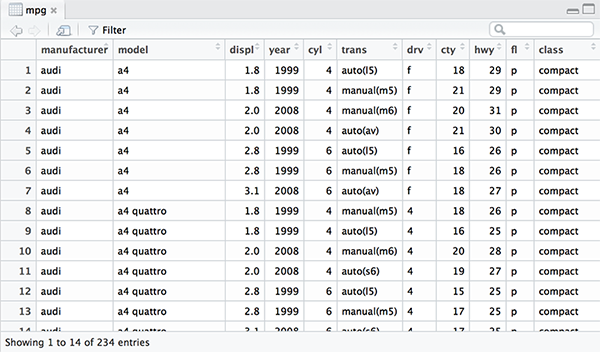
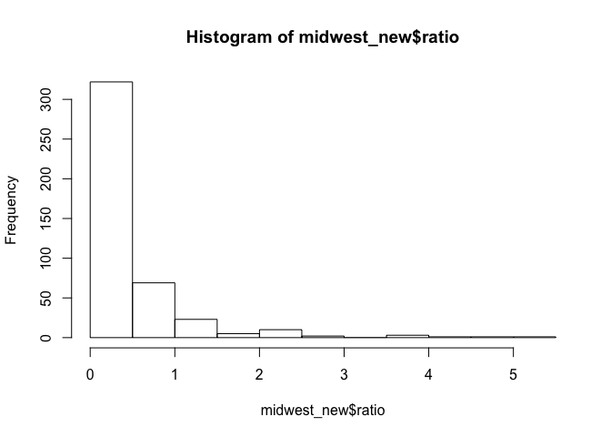

5장 데이타 분석 기초
================

<!-- 05-1 -->
05-1 데이터 파악하기
--------------------

| 함수      | 기능                    |
|-----------|-------------------------|
| head()    | 데이터 앞부분 출력      |
| tail()    | 데이터 뒷부분 출력      |
| View()    | 뷰어 창에서 데이터 확인 |
| dim()     | 데이터 차원 출력        |
| str()     | 데이터 속성 출력        |
| summary() | 요약 통계량 출력        |

<!-- 05-1 -->

------------------------------------------------------------------------

``` r
head(mpg) # 앞에서부터 6행 출력
```

    ##   manufacturer model displ year cyl      trans drv cty hwy fl   class
    ## 1         audi    a4   1.8 1999   4   auto(l5)   f  18  29  p compact
    ## 2         audi    a4   1.8 1999   4 manual(m5)   f  21  29  p compact
    ## 3         audi    a4   2.0 2008   4 manual(m6)   f  20  31  p compact
    ## 4         audi    a4   2.0 2008   4   auto(av)   f  21  30  p compact
    ## 5         audi    a4   2.8 1999   6   auto(l5)   f  16  26  p compact
    ## 6         audi    a4   2.8 1999   6 manual(m5)   f  18  26  p compact

``` r
head(mpg, 2) # 앞에서부터 2행 출력
```

    ##   manufacturer model displ year cyl      trans drv cty hwy fl   class
    ## 1         audi    a4   1.8 1999   4   auto(l5)   f  18  29  p compact
    ## 2         audi    a4   1.8 1999   4 manual(m5)   f  21  29  p compact

<!-- 05-1 -->

------------------------------------------------------------------------

``` r
tail(mpg) # 뒤에서부터 6행 출력
```

    ##     manufacturer  model displ year cyl      trans drv cty hwy fl   class
    ## 229   volkswagen passat   1.8 1999   4   auto(l5)   f  18  29  p midsize
    ## 230   volkswagen passat   2.0 2008   4   auto(s6)   f  19  28  p midsize
    ## 231   volkswagen passat   2.0 2008   4 manual(m6)   f  21  29  p midsize
    ## 232   volkswagen passat   2.8 1999   6   auto(l5)   f  16  26  p midsize
    ## 233   volkswagen passat   2.8 1999   6 manual(m5)   f  18  26  p midsize
    ## 234   volkswagen passat   3.6 2008   6   auto(s6)   f  17  26  p midsize

``` r
tail(mpg, 2) # 뒤에서부터 2행 출력
```

    ##     manufacturer  model displ year cyl      trans drv cty hwy fl   class
    ## 233   volkswagen passat   2.8 1999   6 manual(m5)   f  18  26  p midsize
    ## 234   volkswagen passat   3.6 2008   6   auto(s6)   f  17  26  p midsize

<!-- 05-1 -->

------------------------------------------------------------------------

``` r
View(mpg) # 데이타뷰어창에서 확인
```



<!-- 05-1 -->

------------------------------------------------------------------------

``` r
dim(mpg) # 행, 열 출력
```

    ## [1] 234  11

``` r
str(mpg) # 데이터 속성 확인
```

    ## 'data.frame':    234 obs. of  11 variables:
    ##  $ manufacturer: chr  "audi" "audi" "audi" "audi" ...
    ##  $ model       : chr  "a4" "a4" "a4" "a4" ...
    ##  $ displ       : num  1.8 1.8 2 2 2.8 2.8 3.1 1.8 1.8 2 ...
    ##  $ year        : int  1999 1999 2008 2008 1999 1999 2008 1999 1999 2008 ...
    ##  $ cyl         : int  4 4 4 4 6 6 6 4 4 4 ...
    ##  $ trans       : chr  "auto(l5)" "manual(m5)" "manual(m6)" "auto(av)" ...
    ##  $ drv         : chr  "f" "f" "f" "f" ...
    ##  $ cty         : int  18 21 20 21 16 18 18 18 16 20 ...
    ##  $ hwy         : int  29 29 31 30 26 26 27 26 25 28 ...
    ##  $ fl          : chr  "p" "p" "p" "p" ...
    ##  $ class       : chr  "compact" "compact" "compact" "compact" ...

<!-- 05-1 -->

------------------------------------------------------------------------

``` r
summary(mpg) # 행, 열 출력
```

    ##  manufacturer          model               displ            year     
    ##  Length:234         Length:234         Min.   :1.600   Min.   :1999  
    ##  Class :character   Class :character   1st Qu.:2.400   1st Qu.:1999  
    ##  Mode  :character   Mode  :character   Median :3.300   Median :2004  
    ##                                        Mean   :3.472   Mean   :2004  
    ##                                        3rd Qu.:4.600   3rd Qu.:2008  
    ##                                        Max.   :7.000   Max.   :2008  
    ##       cyl           trans               drv                 cty       
    ##  Min.   :4.000   Length:234         Length:234         Min.   : 9.00  
    ##  1st Qu.:4.000   Class :character   Class :character   1st Qu.:14.00  
    ##  Median :6.000   Mode  :character   Mode  :character   Median :17.00  
    ##  Mean   :5.889                                         Mean   :16.86  
    ##  3rd Qu.:8.000                                         3rd Qu.:19.00  
    ##  Max.   :8.000                                         Max.   :35.00  
    ##       hwy             fl               class          
    ##  Min.   :12.00   Length:234         Length:234        
    ##  1st Qu.:18.00   Class :character   Class :character  
    ##  Median :24.00   Mode  :character   Mode  :character  
    ##  Mean   :23.44                                        
    ##  3rd Qu.:27.00                                        
    ##  Max.   :44.00

| 출력값 | 통계량                  | 설명                               |
|--------|-------------------------|------------------------------------|
| Min    | 최솟값(Minimun)         | 가장작은값                         |
| 1st Qu | 1사분위수(1st Quantile) | 하위 25%(4분의 1)지점에 위치한 값  |
| Median | 중앙값(Median)          | 중앙에 위치하는 값                 |
| Mean   | 평균값(Mean)            | 모든 값을 더해 값의 개수로 나눈 값 |
| 3rd Qu | 3사분위수(3rd Quantile) | 하위 75%(4분의 3)지점에 위치한 값  |
| Max    | 최댓값(Maximum)         | 가장 큰 값                         |

<!-- 05-2 -->
05-2 변수명 바꾸기
------------------

``` r
library(dplyr)
```

``` r
mpg_rename <- rename(mpg, city = cty)
str(mpg_rename)
```

    ## 'data.frame':    234 obs. of  11 variables:
    ##  $ manufacturer: chr  "audi" "audi" "audi" "audi" ...
    ##  $ model       : chr  "a4" "a4" "a4" "a4" ...
    ##  $ displ       : num  1.8 1.8 2 2 2.8 2.8 3.1 1.8 1.8 2 ...
    ##  $ year        : int  1999 1999 2008 2008 1999 1999 2008 1999 1999 2008 ...
    ##  $ cyl         : int  4 4 4 4 6 6 6 4 4 4 ...
    ##  $ trans       : chr  "auto(l5)" "manual(m5)" "manual(m6)" "auto(av)" ...
    ##  $ drv         : chr  "f" "f" "f" "f" ...
    ##  $ city        : int  18 21 20 21 16 18 18 18 16 20 ...
    ##  $ hwy         : int  29 29 31 30 26 26 27 26 25 28 ...
    ##  $ fl          : chr  "p" "p" "p" "p" ...
    ##  $ class       : chr  "compact" "compact" "compact" "compact" ...

------------------------------------------------------------------------

``` r
colnames(mpg_rename)
```

    ##  [1] "manufacturer" "model"        "displ"        "year"        
    ##  [5] "cyl"          "trans"        "drv"          "city"        
    ##  [9] "hwy"          "fl"           "class"

``` r
colnames(mpg_rename)[9] <- "highway"
colnames(mpg_rename)
```

    ##  [1] "manufacturer" "model"        "displ"        "year"        
    ##  [5] "cyl"          "trans"        "drv"          "city"        
    ##  [9] "highway"      "fl"           "class"

<!-- 05-3 -->
05-3 파생변수 만들기
--------------------

``` r
mpg$total <- ( mpg$cty + mpg$hwy ) / 2 # 통합 연비 변수 생성 
head(mpg)
```

    ##   manufacturer model displ year cyl      trans drv cty hwy fl   class
    ## 1         audi    a4   1.8 1999   4   auto(l5)   f  18  29  p compact
    ## 2         audi    a4   1.8 1999   4 manual(m5)   f  21  29  p compact
    ## 3         audi    a4   2.0 2008   4 manual(m6)   f  20  31  p compact
    ## 4         audi    a4   2.0 2008   4   auto(av)   f  21  30  p compact
    ## 5         audi    a4   2.8 1999   6   auto(l5)   f  16  26  p compact
    ## 6         audi    a4   2.8 1999   6 manual(m5)   f  18  26  p compact
    ##   total
    ## 1  23.5
    ## 2  25.0
    ## 3  25.5
    ## 4  25.5
    ## 5  21.0
    ## 6  22.0

<!-- 05-3 -->

------------------------------------------------------------------------

``` r
mean(mpg$total)
```

    ## [1] 20.14957

``` r
summary(mpg$total)
```

    ##    Min. 1st Qu.  Median    Mean 3rd Qu.    Max. 
    ##   10.50   15.50   20.50   20.15   23.50   39.50

------------------------------------------------------------------------

``` r
hist(mpg$total)
```


------------------------------------------------------------------------

``` r
mpg$test <- ifelse(mpg$total > 20, "pass", "fail")
head(mpg)
```

    ##   manufacturer model displ year cyl      trans drv cty hwy fl   class
    ## 1         audi    a4   1.8 1999   4   auto(l5)   f  18  29  p compact
    ## 2         audi    a4   1.8 1999   4 manual(m5)   f  21  29  p compact
    ## 3         audi    a4   2.0 2008   4 manual(m6)   f  20  31  p compact
    ## 4         audi    a4   2.0 2008   4   auto(av)   f  21  30  p compact
    ## 5         audi    a4   2.8 1999   6   auto(l5)   f  16  26  p compact
    ## 6         audi    a4   2.8 1999   6 manual(m5)   f  18  26  p compact
    ##   total test
    ## 1  23.5 pass
    ## 2  25.0 pass
    ## 3  25.5 pass
    ## 4  25.5 pass
    ## 5  21.0 pass
    ## 6  22.0 pass

------------------------------------------------------------------------

``` r
table(mpg$test) # 빈도표 출력
```

    ## 
    ## fail pass 
    ##  111  123

------------------------------------------------------------------------

``` r
qplot(mpg$test) # 막대 그래프 생성 
```


분석도전 p123
-------------

> ggplot2의 midwest 데이터를 데이터 프레임 형태로 불러온 다음 데이터의 특징을 파악하세요

``` r
library(ggplot2)
midwest <- as.data.frame(ggplot2::midwest)
str(midwest)
```

    ## 'data.frame':    437 obs. of  28 variables:
    ##  $ PID                 : int  561 562 563 564 565 566 567 568 569 570 ...
    ##  $ county              : chr  "ADAMS" "ALEXANDER" "BOND" "BOONE" ...
    ##  $ state               : chr  "IL" "IL" "IL" "IL" ...
    ##  $ area                : num  0.052 0.014 0.022 0.017 0.018 0.05 0.017 0.027 0.024 0.058 ...
    ##  $ poptotal            : int  66090 10626 14991 30806 5836 35688 5322 16805 13437 173025 ...
    ##  $ popdensity          : num  1271 759 681 1812 324 ...
    ##  $ popwhite            : int  63917 7054 14477 29344 5264 35157 5298 16519 13384 146506 ...
    ##  $ popblack            : int  1702 3496 429 127 547 50 1 111 16 16559 ...
    ##  $ popamerindian       : int  98 19 35 46 14 65 8 30 8 331 ...
    ##  $ popasian            : int  249 48 16 150 5 195 15 61 23 8033 ...
    ##  $ popother            : int  124 9 34 1139 6 221 0 84 6 1596 ...
    ##  $ percwhite           : num  96.7 66.4 96.6 95.3 90.2 ...
    ##  $ percblack           : num  2.575 32.9 2.862 0.412 9.373 ...
    ##  $ percamerindan       : num  0.148 0.179 0.233 0.149 0.24 ...
    ##  $ percasian           : num  0.3768 0.4517 0.1067 0.4869 0.0857 ...
    ##  $ percother           : num  0.1876 0.0847 0.2268 3.6973 0.1028 ...
    ##  $ popadults           : int  43298 6724 9669 19272 3979 23444 3583 11323 8825 95971 ...
    ##  $ perchsd             : num  75.1 59.7 69.3 75.5 68.9 ...
    ##  $ percollege          : num  19.6 11.2 17 17.3 14.5 ...
    ##  $ percprof            : num  4.36 2.87 4.49 4.2 3.37 ...
    ##  $ poppovertyknown     : int  63628 10529 14235 30337 4815 35107 5241 16455 13081 154934 ...
    ##  $ percpovertyknown    : num  96.3 99.1 95 98.5 82.5 ...
    ##  $ percbelowpoverty    : num  13.15 32.24 12.07 7.21 13.52 ...
    ##  $ percchildbelowpovert: num  18 45.8 14 11.2 13 ...
    ##  $ percadultpoverty    : num  11.01 27.39 10.85 5.54 11.14 ...
    ##  $ percelderlypoverty  : num  12.44 25.23 12.7 6.22 19.2 ...
    ##  $ inmetro             : int  0 0 0 1 0 0 0 0 0 1 ...
    ##  $ category            : chr  "AAR" "LHR" "AAR" "ALU" ...

------------------------------------------------------------------------

> poptotal(전체인구) 변수를 total로, popasian(아시아 인구) 변수를 asian으로 수정하세요

``` r
library(dplyr)
midwest_new <- rename(midwest, total = poptotal, asian = popasian)
str(midwest_new)
```

    ## 'data.frame':    437 obs. of  28 variables:
    ##  $ PID                 : int  561 562 563 564 565 566 567 568 569 570 ...
    ##  $ county              : chr  "ADAMS" "ALEXANDER" "BOND" "BOONE" ...
    ##  $ state               : chr  "IL" "IL" "IL" "IL" ...
    ##  $ area                : num  0.052 0.014 0.022 0.017 0.018 0.05 0.017 0.027 0.024 0.058 ...
    ##  $ total               : int  66090 10626 14991 30806 5836 35688 5322 16805 13437 173025 ...
    ##  $ popdensity          : num  1271 759 681 1812 324 ...
    ##  $ popwhite            : int  63917 7054 14477 29344 5264 35157 5298 16519 13384 146506 ...
    ##  $ popblack            : int  1702 3496 429 127 547 50 1 111 16 16559 ...
    ##  $ popamerindian       : int  98 19 35 46 14 65 8 30 8 331 ...
    ##  $ asian               : int  249 48 16 150 5 195 15 61 23 8033 ...
    ##  $ popother            : int  124 9 34 1139 6 221 0 84 6 1596 ...
    ##  $ percwhite           : num  96.7 66.4 96.6 95.3 90.2 ...
    ##  $ percblack           : num  2.575 32.9 2.862 0.412 9.373 ...
    ##  $ percamerindan       : num  0.148 0.179 0.233 0.149 0.24 ...
    ##  $ percasian           : num  0.3768 0.4517 0.1067 0.4869 0.0857 ...
    ##  $ percother           : num  0.1876 0.0847 0.2268 3.6973 0.1028 ...
    ##  $ popadults           : int  43298 6724 9669 19272 3979 23444 3583 11323 8825 95971 ...
    ##  $ perchsd             : num  75.1 59.7 69.3 75.5 68.9 ...
    ##  $ percollege          : num  19.6 11.2 17 17.3 14.5 ...
    ##  $ percprof            : num  4.36 2.87 4.49 4.2 3.37 ...
    ##  $ poppovertyknown     : int  63628 10529 14235 30337 4815 35107 5241 16455 13081 154934 ...
    ##  $ percpovertyknown    : num  96.3 99.1 95 98.5 82.5 ...
    ##  $ percbelowpoverty    : num  13.15 32.24 12.07 7.21 13.52 ...
    ##  $ percchildbelowpovert: num  18 45.8 14 11.2 13 ...
    ##  $ percadultpoverty    : num  11.01 27.39 10.85 5.54 11.14 ...
    ##  $ percelderlypoverty  : num  12.44 25.23 12.7 6.22 19.2 ...
    ##  $ inmetro             : int  0 0 0 1 0 0 0 0 0 1 ...
    ##  $ category            : chr  "AAR" "LHR" "AAR" "ALU" ...

------------------------------------------------------------------------

> total, asian 변수를 이용해 '전체 인구 대비 아시아 인구 백분율' 파생변수를 만들고 히스토그램을 만들어 도시들이 어떻게 분포하는지 살펴보세요

``` r
midwest_new$ratio <- midwest_new$asian / midwest_new$total * 100
hist(midwest_new$ratio)
```



------------------------------------------------------------------------

> 아시아 인구 백분율 전체 평균을 구하고, 평균을 초과하면 "large", 그 외에는 "small"을 부여하는 파생변수를 만들어 보세요.

``` r
midwest_new_ratio_mean <- mean(midwest_new$ratio)
midwest_new$group <- ifelse(midwest_new$ratio > midwest_new_ratio_mean, "large", "small")
```

> "large"와 "small"에 해당하는 지역이 얼마나 되는지 빈도표와 빈도 막대 그래프를 만들어 확인해 보세요

``` r
table(midwest_new$group)
```

    ## 
    ## large small 
    ##   119   318

``` r
qplot(midwest_new$group)
```


