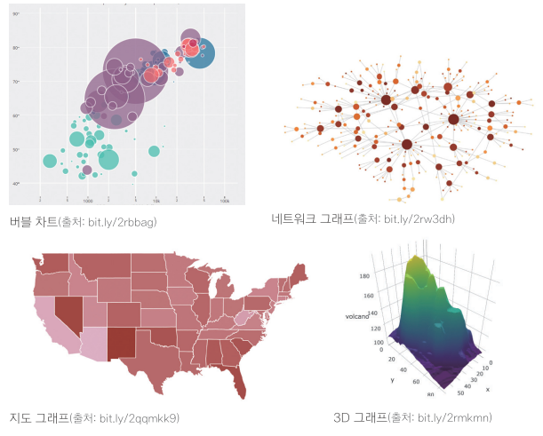
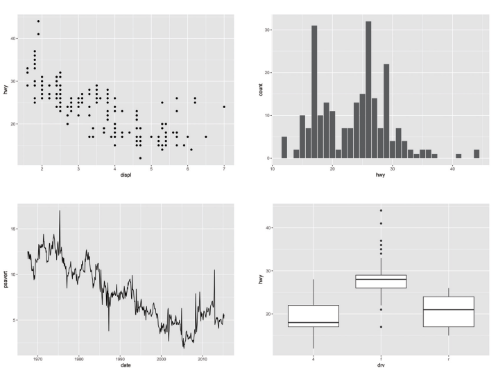
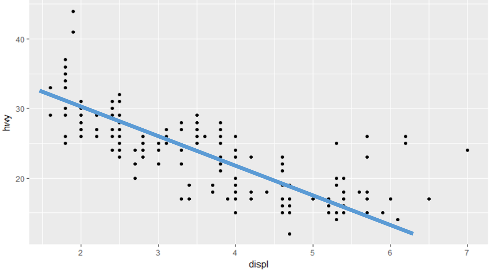
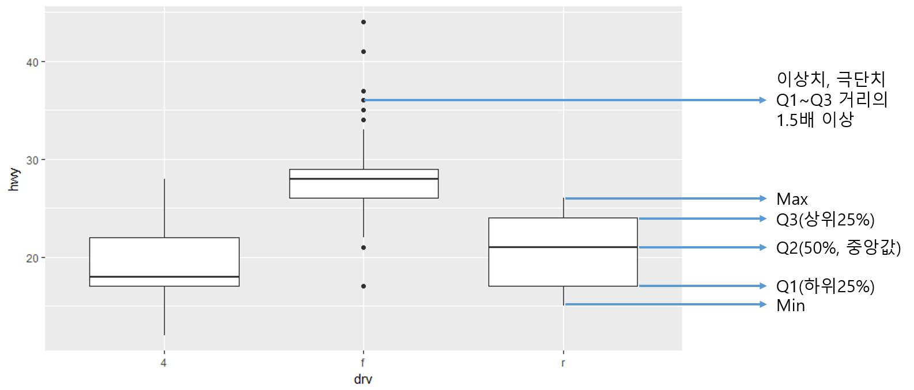

```{r setup, include=FALSE}
knitr::opts_chunk$set(echo = TRUE)
```

# Chapter8. 그래프 만들기

## 08-1. R로 만들 수 있는 그래프

- 버블차트
- 네트워크 그래프
- 지도 그래프
- 3D 그래프



### ggplot2 패키지를 이용한 그래프 만들기

- 산점도
- 막대 그래프
- 선 그래프
- 상자 그래프



#### ggplot2 레이어는 아래와 같이 구성되어 있음


```{r, warning=F, message=F}
#ggplot2 로드
library(ggplot2)
```


## 08-2. 산점도

#### 산점도는 두 변수간의 관계를 나타낼 때 주로 사용함

#### 1. 배경설정
```{r, warning=F, message=F}
# data mpg, x축 배기량(displ), y축 고속도로 연비(hwy)
ggplot(data=mpg, aes(x=displ, y=hwy))
```

#### 2. 그래프 그리기

##### 산점도 그리기 geom_point() 사용
##### dplyr 패키지는 %>% 로 연결하는 반면, ggplot2 패키지는 + 기호로 연결

```{r, warning=F, message=F}
ggplot(data=mpg, aes(x=displ, y=hwy)) + geom_point()
```




##### 회귀선 그리기
```{r, warning=F, message=F}
ggplot(data=mpg, aes(x=displ, y=hwy)) + geom_point() + stat_smooth(method=lm, se=F)
```

##### 신뢰구가 95% 영역 표시
```{r, warning=F, message=F}
ggplot(data=mpg, aes(x=displ, y=hwy)) + geom_point() + stat_smooth(method=lm, level=0.99)
```


#### 3. 축 범위 설정

##### x축 범위 xlim(), y축 범위 ylim()

```{r, warning=F, message=F}
# x축 범위 3-6, y축 범위 10-30 설정
ggplot(data=mpg, aes(x=displ, y=hwy)) + geom_point() + xlim(3,6) + ylim(10,30)
```

##### + 기호 다음에 엔터키로 줄을 바꾸면 가독성을 높일 수 있음

## 08-3. 막대 그래프

#### 막대 그래프는 집단 간의 차이를 나타낼 때 주로 사용함

#### 1. 집단별 평균표

##### mpg 데이터를 이용하여 drv(구동방식)별 평균 hwy(고속도로 연비) 막대그래프 만들기

##### 1-1. dplyr 패키지를 이용하여 drv별 hwy 데이터 프레임 만들기

```{r, warning=F, message=F}
library(dplyr)

df_mpg <- mpg %>%
  group_by(drv) %>% 
  summarise(mean_hwy = mean(hwy))

df_mpg
```

### 2. 그래프 생성하기

##### 막대 그래프 그리기 geom_col() 사용

```{r, warning=F, message=F}
# data df_mpg, x축 범주, y축 평균 변수 지정
ggplot(data=df_mpg, aes(x=drv, y=mean_hwy)) + geom_col()
```

### 3. 크기 순 정렬

##### 크기 순 정렬 명령어 reorder() 활용
##### 정렬기준 변수 앞에 - 기호를 붙이면 내림차순으로 정렬
```{r, warning=F, message=F}
#reorder(x축 변수, 정렬기준 변수)
ggplot(data=df_mpg, aes(x=reorder(drv, -mean_hwy), y=mean_hwy)) + geom_col()
```

## 08-3_1. 빈도 막대 그래프

#### 빈도를 막대 그래프로 표현
#### y축 없이 x축만 지정하고 geom_col() 대신 geom_bar() 사용
```{r, warning=F, message=F}
ggplot(data=mpg, aes(x=drv)) + geom_bar()
```

## 08-4. 선 그래프

#### 시간에 따라 달라지는 그래프를 나타낼 때 주로 사용함

#### 1. economics 데이터를 이용한 선 그래프 만들기
#### 선 그래프 그리기 geom_line() 사용
```{r, warning=F, message=F}
# data economics, x축 시간(date), y축 실업자수(unemploy) 지정
ggplot(data=economics, aes(x=date, y=unemploy)) + geom_line()
```

## 08-5. 상자 그래프

#### 데이터 평균 보다 조금 더 자세히 알고 싶을 때 주로 사용
#### 상자 그래프 그리기 geom_boxplot() 사용
```{r, warning=F, message=F}
# data mpg, x축 구동방식(drv), y축 고속도로 연비(hwy) 지정
ggplot(data=mpg, aes(x=drv, y=hwy)) + geom_boxplot()
```


