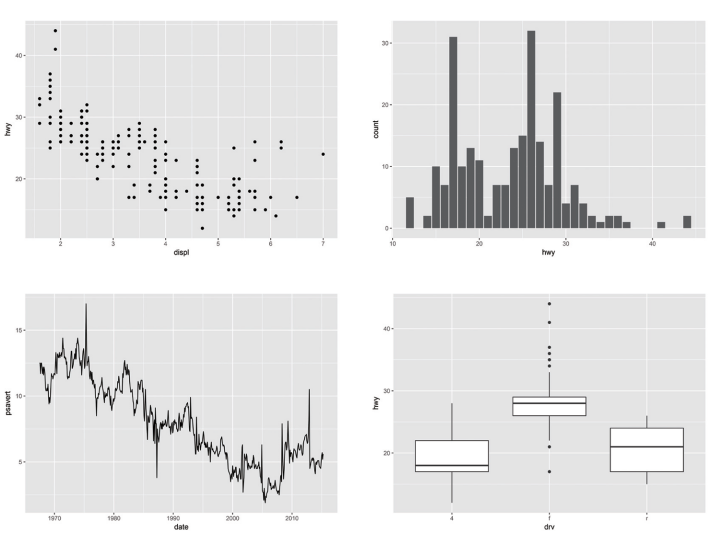
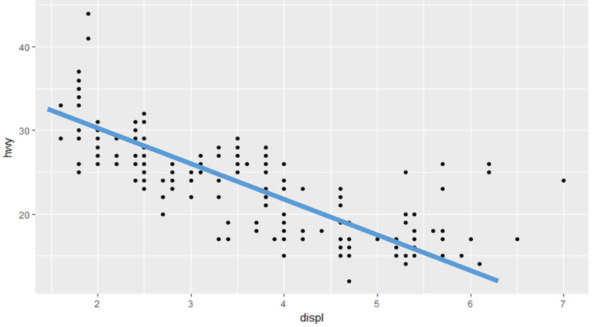
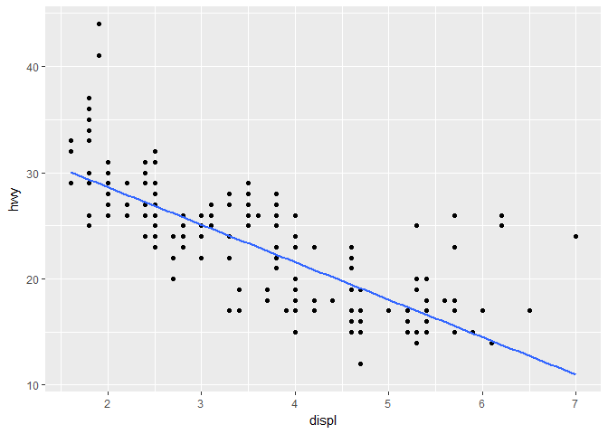

chapter08
================

Chapter8. 그래프 만들기
=======================

08-1. R로 만들 수 있는 그래프
-----------------------------

-   버블차트
-   네트워크 그래프
-   지도 그래프
-   3D 그래프


### ggplot2 패키지를 이용한 그래프 만들기

-   산점도
-   막대 그래프
-   선 그래프
-   상자 그래프



#### ggplot2 레이어는 아래와 같이 구성되어 있음


``` r
#ggplot2 로드
library(ggplot2)
```

08-2. 산점도
------------

#### 산점도는 두 변수간의 관계를 나타낼 때 주로 사용함

#### 1. 배경설정

``` r
# data mpg, x축 배기량(displ), y축 고속도로 연비(hwy)
ggplot(data=mpg, aes(x=displ, y=hwy))
```


#### 2. 그래프 그리기

##### 산점도 그리기 geom\_point() 사용

##### dplyr 패키지는 %&gt;% 로 연결하는 반면, ggplot2 패키지는 + 기호로 연결

``` r
ggplot(data=mpg, aes(x=displ, y=hwy)) + geom_point()
```




#### 3. 축 범위 설정

##### x축 범위 xlim(), y축 범위 ylim()

``` r
# x축 범위 3-6, y축 범위 10-30 설정
ggplot(data=mpg, aes(x=displ, y=hwy)) + geom_point() + xlim(3,6) + ylim(10,30)
```



##### + 기호 다음에 엔터키로 줄을 바꾸면 가독성을 높일 수 있음

08-3. 막대 그래프
-----------------

#### 막대 그래프는 집단 간의 차이를 나타낼 때 주로 사용함

#### 1. 집단별 평균표

##### mpg 데이터를 이용하여 drv(구동방식)별 평균 hwy(고속도로 연비) 막대그래프 만들기

##### 1-1. dplyr 패키지를 이용하여 drv별 hwy 데이터 프레임 만들기

``` r
library(dplyr)

df_mpg <- mpg %>%
  group_by(drv) %>% 
  summarise(mean_hwy = mean(hwy))

df_mpg
```

    ## # A tibble: 3 x 2
    ##     drv mean_hwy
    ##   <chr>    <dbl>
    ## 1     4 19.17476
    ## 2     f 28.16038
    ## 3     r 21.00000

### 2. 그래프 생성하기

##### 막대 그래프 그리기 geom\_col() 사용

``` r
# data df_mpg, x축 범주, y축 평균 변수 지정
ggplot(data=df_mpg, aes(x=drv, y=mean_hwy)) + geom_col()
```


### 3. 크기 순 정렬

##### 크기 순 정렬 명령어 reorder() 활용

##### 정렬기준 변수 앞에 - 기호를 붙이면 내림차순으로 정렬

``` r
#reorder(x축 변수, 정렬기준 변수)
ggplot(data=df_mpg, aes(x=reorder(drv, -mean_hwy), y=mean_hwy)) + geom_col()
```


08-3\_1. 빈도 막대 그래프
-------------------------

#### 빈도를 막대 그래프로 표현

#### y축 없이 x축만 지정하고 geom\_col() 대신 geom\_bar() 사용

``` r
ggplot(data=mpg, aes(x=drv)) + geom_bar()
```


08-4. 선 그래프
---------------

#### 시간에 따라 달라지는 그래프를 나타낼 때 주로 사용함

#### 1. economics 데이터를 이용한 선 그래프 만들기

#### 선 그래프 그리기 geom\_line() 사용

``` r
# data economics, x축 시간(date), y축 실업자수(unemploy) 지정
ggplot(data=economics, aes(x=date, y=unemploy)) + geom_line()
```


08-5. 상자 그래프
-----------------

#### 데이터 평균 보다 조금 더 자세히 알고 싶을 때 주로 사용

#### 상자 그래프 그리기 geom\_boxplot() 사용

``` r
# data mpg, x축 구동방식(drv), y축 고속도로 연비(hwy) 지정
ggplot(data=mpg, aes(x=drv, y=hwy)) + geom_boxplot()
```


