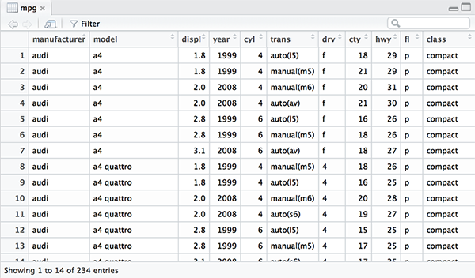

```{r setup, include=FALSE}
knitr::opts_chunk$set(echo = FALSE)
```

<!-- 5장 차례 --> 
## 5장 데이터 분석 기초 

### 05-1 데이터 파악하기
### 05-2 변수명 바꾸기
### 05-3 파생변수 만들기


<!-- 4장 복습 -->
##4장 데이터 프레임의 세계로!

###04-1 데이터는 어떻게 생겼나? - 데이터 프레임의 이해
###04-2 데이터 프레임 만들기 - 시험 성적 데이터를 만들어 보자!
###04-3 외부 데이터 이용하기 - 축적된 시험 성적 데이터를 불러오자!


<!-- 04-1 -->
##04-1 데이터는 어떻게 생겼나? - 데이터 프레임의 이해

이름   | 영어점수 | 수학점수 
-      | -        | -
김지훈 | 90       | 50
이유진 | 80       | 60
박동현 | 60       | 100
김민지 | 70       | 20

<div class="notes">
- 행 Row, 열 Column 
- 케이스 Case, 변수 Variable 
- 관측치 Observation, 변수 Variable
</div>


<!-- 04-2 -->
##04-2 데이터 프레임 만들기 - 시험 성적 데이터를 만들어 보자!
```{r echo=TRUE}
df_midterm <- data.frame(english = c(90, 80, 60, 70),
                         math = c(50, 60, 100, 20),
                         class = c(1, 1, 2, 2))
df_midterm
```


<!-- 04-3 -->
##04-3 외부 데이터 이용하기 - 축적된 시험 성적 데이터를 불러오자!

```{r echo=TRUE, eval=FALSE}
# 엑셀 파일
library(readxl)
df_exam <- read_excel("cexel_exam.xlsx")

# csv 파일
df_csv_exam <- read.csv("csv_exam.csv")
write.csv(df_midterm, file = "df_midframe.csv")

# rda 파일
load("df_midframe.rda")
save(df_midterm, file = "df_midframe.rda")
```

<div class="notes">
- sav : foreign read.spss()
- txt : read.table()
- xml : XML 
- Ctrl-C, Ctrl-V : read.delim("clipboard")
</div>


<!-- 5장 차례 --> 
## 5장 데이터 분석 기초 

### 05-1 데이터 파악하기
### 05-2 변수명 바꾸기
### 05-3 파생변수 만들기


<!-- 05-1 -->
## 05-1 데이터 파악하기

함수      | 기능
-         | - 
head()    | 데이터 앞부분 출력
tail()    | 데이터 뒷부분 출력
View()    | 뷰어 창에서 데이터 확인
dim()     | 데이터 차원 출력
str()     | 데이터 속성 출력
summary() | 요약 통계량 출력 


<!-- 05-1 -->
***
```{r, message=FALSE, warning=FALSE, include=FALSE}
library(ggplot2)
mpg <- as.data.frame(ggplot2::mpg)
```

```{r echo=TRUE}
head(mpg) # 앞에서부터 6행 출력
```

```{r echo=TRUE}
head(mpg, 2) # 앞에서부터 2행 출력
```


<!-- 05-1 -->
***
```{r echo=TRUE}
tail(mpg) # 뒤에서부터 6행 출력
```

```{r echo=TRUE}
tail(mpg, 2) # 뒤에서부터 2행 출력
```


<!-- 05-1 -->
***
```{r echo=TRUE, eval=FALSE}
View(mpg) # 데이타뷰어창에서 확인
```




<!-- 05-1 -->
***
```{r echo=TRUE}
dim(mpg) # 행, 열 출력
```

```{r echo=TRUE}
str(mpg) # 데이터 속성 확인
```


<!-- 05-1 -->
***
```{r echo=TRUE}
summary(mpg) # 행, 열 출력
```

<div class="notes">
출력값 | 통계량 | 설명
-      | -      | -
Min    | 최솟값(Minimun) | 가장작은값
1st Qu | 1사분위수(1st Quantile) | 하위 25%(4분의 1)지점에 위치한 값
Median | 중앙값(Median) | 중앙에 위치하는 값
Mean   | 평균값(Mean) | 모든 값을 더해 값의 개수로 나눈 값
3rd Qu | 3사분위수(3rd Quantile) | 하위 75%(4분의 3)지점에 위치한 값
Max    | 최댓값(Maximum) | 가장 큰 값
</div>


<!-- 05-2 -->
## 05-2 변수명 바꾸기

```{r, echo=TRUE, message=FALSE, warning=FALSE}
library(dplyr)
```

```{r echo=TRUE}
mpg_rename <- rename(mpg, city = cty)
str(mpg_rename)
```


***
```{r echo=TRUE}
colnames(mpg_rename)
```

```{r echo=TRUE}
colnames(mpg_rename)[9] <- "highway"
colnames(mpg_rename)
```


<!-- 05-3 -->
## 05-3 파생변수 만들기

```{r echo=TRUE}
mpg$total <- ( mpg$cty + mpg$hwy ) / 2 # 통합 연비 변수 생성 
head(mpg)
```


<!-- 05-3 -->
***
```{r echo=TRUE}
mean(mpg$total)
summary(mpg$total)
```

***
```{r echo=TRUE}
hist(mpg$total)
```

***
```{r echo=TRUE}
mpg$test <- ifelse(mpg$total > 20, "pass", "fail")
head(mpg)
```

***
```{r echo=TRUE}
table(mpg$test) # 빈도표 출력
```

***
```{r echo=TRUE}
qplot(mpg$test) # 막대 그래프 생성 
```

## 분석도전 p123
> ggplot2의 midwest 데이터를 데이터 프레임 형태로 불러온 다음 데이터의 특징을 파악하세요

```{r message=FALSE, warning=FALSE, echo=TRUE}
library(ggplot2)
midwest <- as.data.frame(ggplot2::midwest)
str(midwest)
```

***
> poptotal(전체인구) 변수를 total로, popasian(아시아 인구) 변수를 asian으로 수정하세요

```{r message=FALSE, warning=FALSE, echo=TRUE}
library(dplyr)
midwest_new <- rename(midwest, total = poptotal, asian = popasian)
str(midwest_new)
```

***
> total, asian 변수를 이용해 '전체 인구 대비 아시아 인구 백분율' 파생변수를 만들고 히스토그램을 만들어 도시들이 어떻게 분포하는지 살펴보세요

```{r message=FALSE, warning=FALSE, echo=TRUE}
midwest_new$ratio <- midwest_new$asian / midwest_new$total * 100
hist(midwest_new$ratio)
```

***
> 아시아 인구 백분율 전체 평균을 구하고, 평균을 초과하면 "large", 그 외에는 "small"을 부여하는 파생변수를 만들어 보세요.

```{r message=FALSE, warning=FALSE, echo=TRUE}
midwest_new_ratio_mean <- mean(midwest_new$ratio)
midwest_new$group <- ifelse(midwest_new$ratio > midwest_new_ratio_mean, "large", "small")
```

> "large"와 "small"에 해당하는 지역이 얼마나 되는지 빈도표와 빈도 막대 그래프를 만들어 확인해 보세요

```{r message=FALSE, warning=FALSE, echo=TRUE}
table(midwest_new$group)
```
***
```{r message=FALSE, warning=FALSE, echo=TRUE}
qplot(midwest_new$group)
```

##끝