Lab 2.3
================

2.3.1 Basic Commands
--------------------

-   create a vector of numbers

``` r
x <- c(1,3,2,5)
x
```

    ## [1] 1 3 2 5

``` r
x = c(1,6,2)
x
```

    ## [1] 1 6 2

``` r
y = c(1,4,3)
```

-   check their length

``` r
length(x)
```

    ## [1] 3

``` r
length(y)
```

    ## [1] 3

-   list of all of the objects

``` r
ls()
```

    ## [1] "x" "y"

``` r
rm(x,y) # to remove all objects at once: rm(list=ls())
ls()
```

    ## character(0)

-   matrix

``` r
x = matrix(data=c(1,2,3,4), nrow=2, ncol=2) # x=matrix(c(1,2,3,4), 2,2)
x
```

    ##      [,1] [,2]
    ## [1,]    1    3
    ## [2,]    2    4

``` r
matrix(c(1,2,3,4), 2,2, byrow=TRUE)
```

    ##      [,1] [,2]
    ## [1,]    1    2
    ## [2,]    3    4

``` r
sqrt(x)
```

    ##          [,1]     [,2]
    ## [1,] 1.000000 1.732051
    ## [2,] 1.414214 2.000000

``` r
x^2
```

    ##      [,1] [,2]
    ## [1,]    1    9
    ## [2,]    4   16

-   random normal variables

``` r
x = rnorm(50)
y = x+rnorm(50, mean=50, sd=.1)
cor(x,y)
```

    ## [1] 0.9935107

``` r
set.seed(1303)
rnorm(50)
```

    ##  [1] -1.1439763145  1.3421293656  2.1853904757  0.5363925179  0.0631929665
    ##  [6]  0.5022344825 -0.0004167247  0.5658198405 -0.5725226890 -1.1102250073
    ## [11] -0.0486871234 -0.6956562176  0.8289174803  0.2066528551 -0.2356745091
    ## [16] -0.5563104914 -0.3647543571  0.8623550343 -0.6307715354  0.3136021252
    ## [21] -0.9314953177  0.8238676185  0.5233707021  0.7069214120  0.4202043256
    ## [26] -0.2690521547 -1.5103172999 -0.6902124766 -0.1434719524 -1.0135274099
    ## [31]  1.5732737361  0.0127465055  0.8726470499  0.4220661905 -0.0188157917
    ## [36]  2.6157489689 -0.6931401748 -0.2663217810 -0.7206364412  1.3677342065
    ## [41]  0.2640073322  0.6321868074 -1.3306509858  0.0268888182  1.0406363208
    ## [46]  1.3120237985 -0.0300020767 -0.2500257125  0.0234144857  1.6598706557

-   compute the mean and variance

``` r
set.seed(3)
y = rnorm(100)

mean(y)
```

    ## [1] 0.01103557

``` r
var(y)
```

    ## [1] 0.7328675

``` r
sqrt(var(y))
```

    ## [1] 0.8560768

``` r
sd(y)
```

    ## [1] 0.8560768

2.3.2 Graphics
--------------

-   plot

``` r
x = rnorm(100)
y = rnorm(100)
plot(x, y)
```

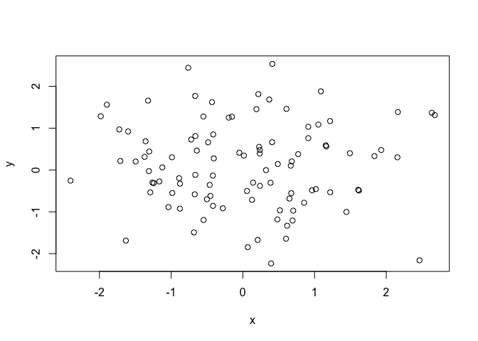

``` r
plot(x, y, xlab="this is the x-axis", ylab="this is the y-axis", main="Plot of X vs Y")
```

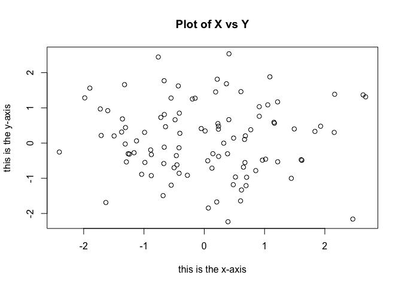

-   save the output

``` r
pdf("Figure.pdf")
plot(x, y, col="green")
dev.off() # indicates to R that we are done creating the plot
```

    ## quartz_off_screen 
    ##                 2

-   sequence

``` r
x = seq(1, 10)


x = 1:10
x
```

    ##  [1]  1  2  3  4  5  6  7  8  9 10

``` r
x = seq(-pi, pi, length=50)
x
```

    ##  [1] -3.14159265 -3.01336438 -2.88513611 -2.75690784 -2.62867957
    ##  [6] -2.50045130 -2.37222302 -2.24399475 -2.11576648 -1.98753821
    ## [11] -1.85930994 -1.73108167 -1.60285339 -1.47462512 -1.34639685
    ## [16] -1.21816858 -1.08994031 -0.96171204 -0.83348377 -0.70525549
    ## [21] -0.57702722 -0.44879895 -0.32057068 -0.19234241 -0.06411414
    ## [26]  0.06411414  0.19234241  0.32057068  0.44879895  0.57702722
    ## [31]  0.70525549  0.83348377  0.96171204  1.08994031  1.21816858
    ## [36]  1.34639685  1.47462512  1.60285339  1.73108167  1.85930994
    ## [41]  1.98753821  2.11576648  2.24399475  2.37222302  2.50045130
    ## [46]  2.62867957  2.75690784  2.88513611  3.01336438  3.14159265

-   contour plot

``` r
y = x
f = outer(x, y, function(x,y) cos(y)/(1+x^2))
contour(x, y, f)
contour(x, y, f, nlevels=45, add=T)
```

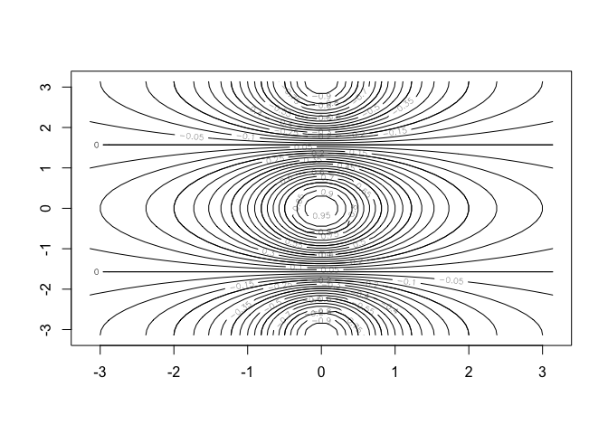

``` r
fa = (f-t(f))/2
contour(x, y, fa, nlevels=15)
```

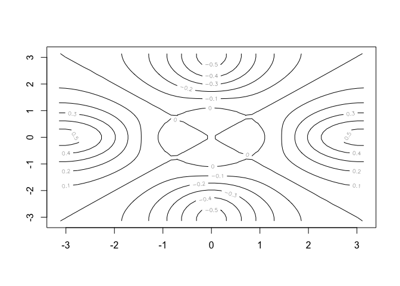

``` r
image(x, y, fa)
```

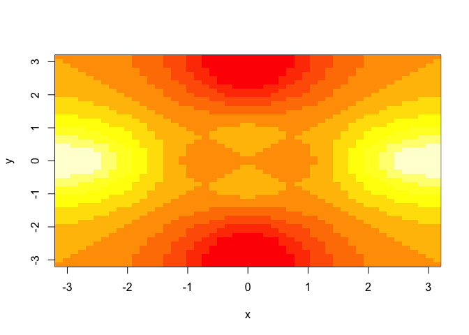

``` r
persp(x, y, fa)
```

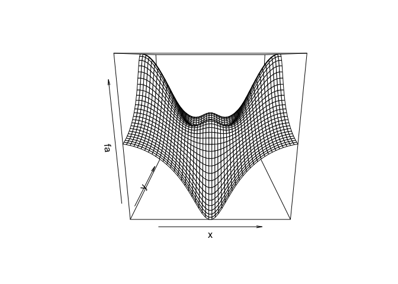

``` r
persp(x, y, fa, theta=30)
```

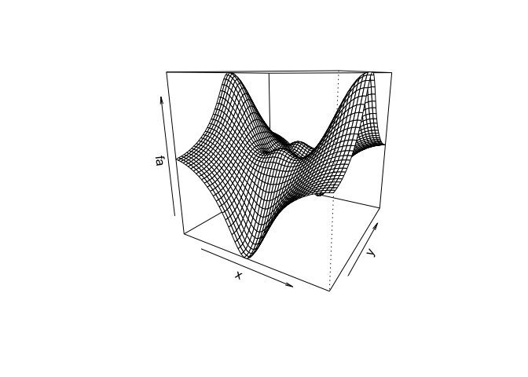

``` r
persp(x, y, fa, theta=30, phi=20)
```

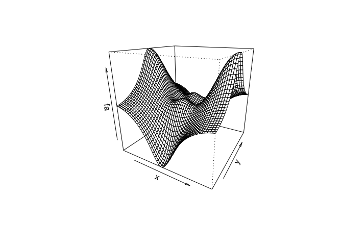

``` r
persp(x, y, fa, theta=30, phi=70)
```

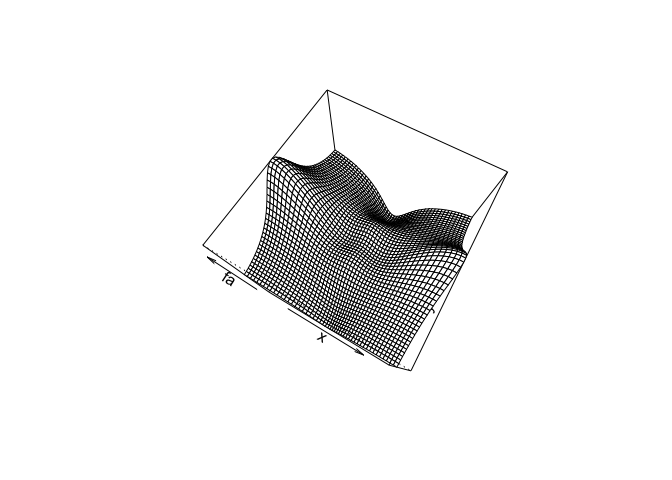

``` r
persp(x, y, fa, theta=30, phi=40)
```

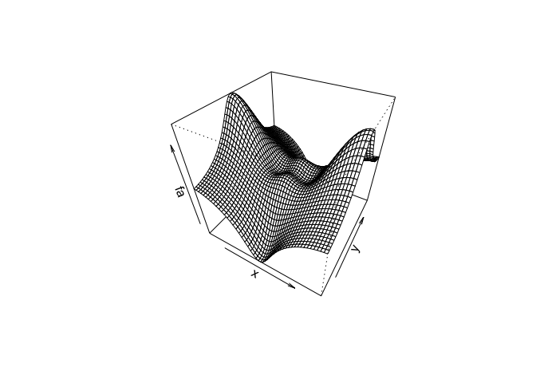

2.3.3 Indexing Data
-------------------

-   select elements

``` r
A = matrix(1:16, 4, 4)
A
```

    ##      [,1] [,2] [,3] [,4]
    ## [1,]    1    5    9   13
    ## [2,]    2    6   10   14
    ## [3,]    3    7   11   15
    ## [4,]    4    8   12   16

``` r
A[2,3]
```

    ## [1] 10

``` r
# rows 1, 3 / cols 2, 4
A[c(1,3), c(2,4)]
```

    ##      [,1] [,2]
    ## [1,]    5   13
    ## [2,]    7   15

``` r
# rows 1:3 / cols 2:4
A[1:3, 2:4]
```

    ##      [,1] [,2] [,3]
    ## [1,]    5    9   13
    ## [2,]    6   10   14
    ## [3,]    7   11   15

``` r
# rows 1:2 / all cols
A[1:2,]
```

    ##      [,1] [,2] [,3] [,4]
    ## [1,]    1    5    9   13
    ## [2,]    2    6   10   14

``` r
# all rows / cols 1:2
A[,1:2]
```

    ##      [,1] [,2]
    ## [1,]    1    5
    ## [2,]    2    6
    ## [3,]    3    7
    ## [4,]    4    8

``` r
# row 1 / all cols
A[1,]
```

    ## [1]  1  5  9 13

``` r
# rows except 1, 3 / all cols
A[-c(1,3),]
```

    ##      [,1] [,2] [,3] [,4]
    ## [1,]    2    6   10   14
    ## [2,]    4    8   12   16

``` r
# rows excpet 1, 3 / cols except 1, 3, 4
A[-c(1,3), -c(1,3,4)]
```

    ## [1] 6 8

``` r
# number of rows, number of cols
dim(A)
```

    ## [1] 4 4

2.3.4 Loading Data
------------------

-   read data

``` r
Auto = read.table("../../../../datasets/Auto.data", header=T, na.strings="?")
fix(Auto)
dim(Auto)
```

    ## [1] 397   9

``` r
Auto[1:4,]
```

    ##   mpg cylinders displacement horsepower weight acceleration year origin
    ## 1  18         8          307        130   3504         12.0   70      1
    ## 2  15         8          350        165   3693         11.5   70      1
    ## 3  18         8          318        150   3436         11.0   70      1
    ## 4  16         8          304        150   3433         12.0   70      1
    ##                        name
    ## 1 chevrolet chevelle malibu
    ## 2         buick skylark 320
    ## 3        plymouth satellite
    ## 4             amc rebel sst

-   omit the missing data

``` r
Auto = na.omit(Auto)
dim(Auto)
```

    ## [1] 392   9

``` r
names(Auto)
```

    ## [1] "mpg"          "cylinders"    "displacement" "horsepower"  
    ## [5] "weight"       "acceleration" "year"         "origin"      
    ## [9] "name"

2.3.5 Additional Graphical and Numerical Summaries
--------------------------------------------------

-   plot the data

``` r
plot(Auto$cylinders, Auto$mpg)
```

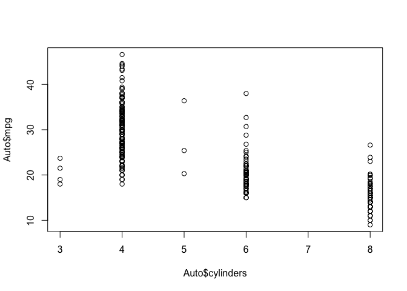

``` r
# alternative way
attach(Auto)
plot(cylinders, mpg)
```

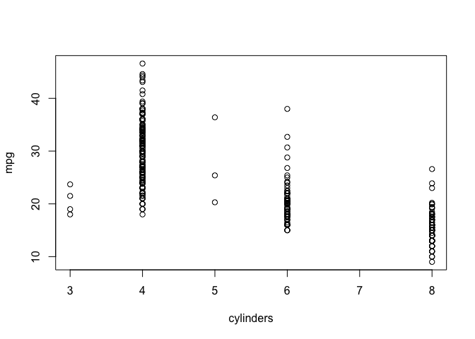

-   qualitative variables

``` r
cylinders = as.factor(cylinders)

plot(cylinders, mpg)
```

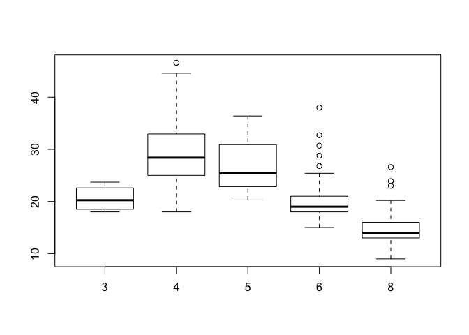

``` r
plot(cylinders, mpg, col="red")
```

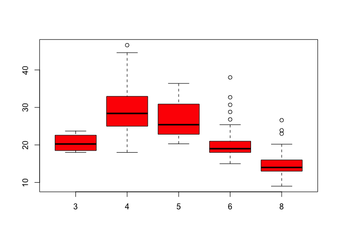

``` r
plot(cylinders, mpg, col="red", varwidth=T)
```

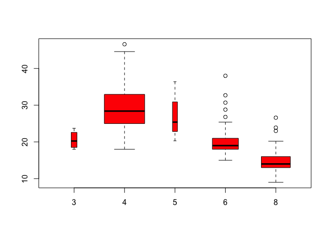

``` r
plot(cylinders, mpg, col="red", varwidth=T, horizontal=T)
```

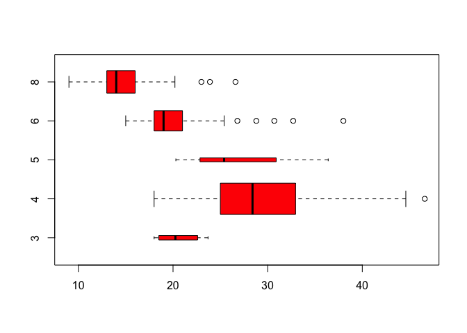

``` r
plot(cylinders, mpg, col="red", varwidth=T, xlab="cylinders", ylab="MPG")
```


-   histogram

``` r
hist(mpg)
```

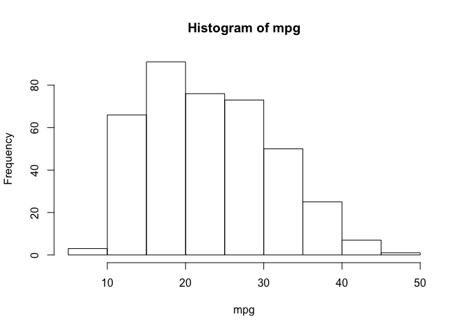

``` r
hist(mpg, col=2) # same effect as col="red"
```

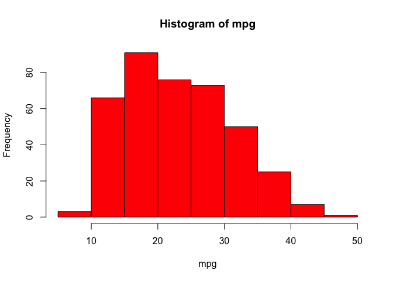

``` r
hist(mpg, col=2, breaks=15)
```

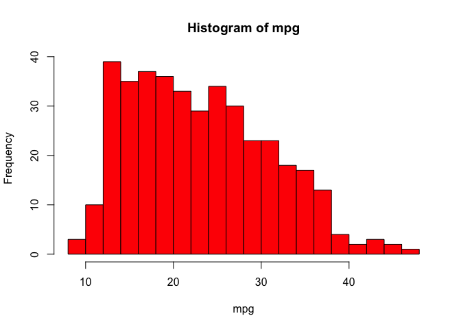

-   scatterplot

``` r
pairs(Auto)
```

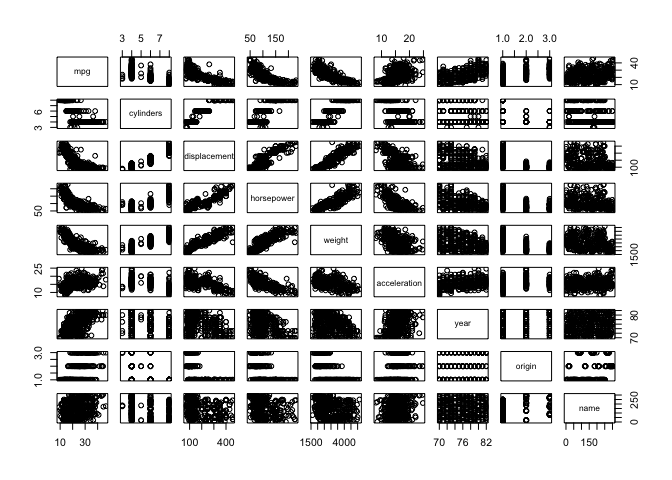

``` r
# produce scatterplots for just a subset of the variables
pairs(~ mpg + displacement + horsepower + weight + acceleration, Auto)
```

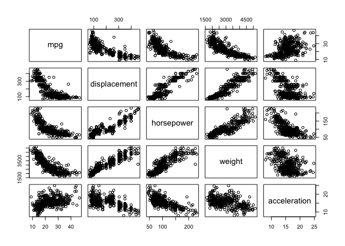

-   summary

``` r
# numerical sujmary of each variable in the Auto dataset
summary(Auto)
```

    ##       mpg          cylinders      displacement     horsepower   
    ##  Min.   : 9.00   Min.   :3.000   Min.   : 68.0   Min.   : 46.0  
    ##  1st Qu.:17.00   1st Qu.:4.000   1st Qu.:105.0   1st Qu.: 75.0  
    ##  Median :22.75   Median :4.000   Median :151.0   Median : 93.5  
    ##  Mean   :23.45   Mean   :5.472   Mean   :194.4   Mean   :104.5  
    ##  3rd Qu.:29.00   3rd Qu.:8.000   3rd Qu.:275.8   3rd Qu.:126.0  
    ##  Max.   :46.60   Max.   :8.000   Max.   :455.0   Max.   :230.0  
    ##                                                                 
    ##      weight      acceleration        year           origin     
    ##  Min.   :1613   Min.   : 8.00   Min.   :70.00   Min.   :1.000  
    ##  1st Qu.:2225   1st Qu.:13.78   1st Qu.:73.00   1st Qu.:1.000  
    ##  Median :2804   Median :15.50   Median :76.00   Median :1.000  
    ##  Mean   :2978   Mean   :15.54   Mean   :75.98   Mean   :1.577  
    ##  3rd Qu.:3615   3rd Qu.:17.02   3rd Qu.:79.00   3rd Qu.:2.000  
    ##  Max.   :5140   Max.   :24.80   Max.   :82.00   Max.   :3.000  
    ##                                                                
    ##                  name    
    ##  amc matador       :  5  
    ##  ford pinto        :  5  
    ##  toyota corolla    :  5  
    ##  amc gremlin       :  4  
    ##  amc hornet        :  4  
    ##  chevrolet chevette:  4  
    ##  (Other)           :365

``` r
# produce a summary of just a single variable
summary(mpg)
```

    ##    Min. 1st Qu.  Median    Mean 3rd Qu.    Max. 
    ##    9.00   17.00   22.75   23.45   29.00   46.60
