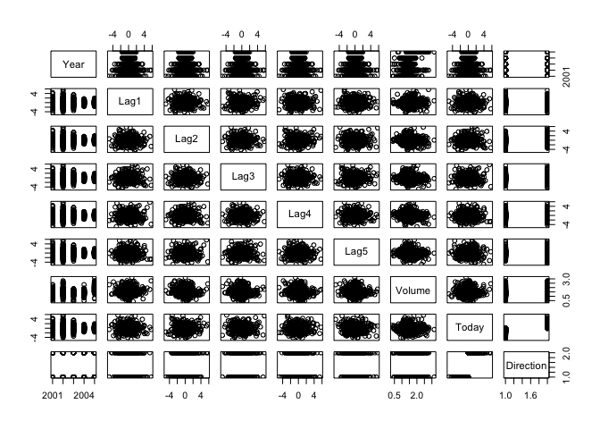
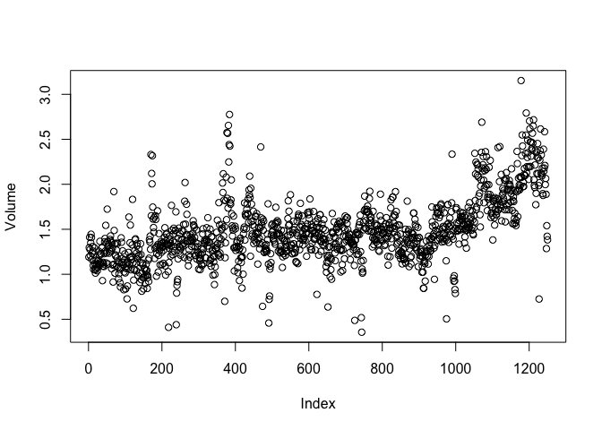

Lab 4.6
================

4.6.1 The Stock Market Data
---------------------------

-   examining some numerical and graphical summaries of the `Smarket` data

``` r
library(ISLR)
names(Smarket)
```

    ## [1] "Year"      "Lag1"      "Lag2"      "Lag3"      "Lag4"      "Lag5"     
    ## [7] "Volume"    "Today"     "Direction"

``` r
dim(Smarket)
```

    ## [1] 1250    9

``` r
summary(Smarket)
```

    ##       Year           Lag1                Lag2          
    ##  Min.   :2001   Min.   :-4.922000   Min.   :-4.922000  
    ##  1st Qu.:2002   1st Qu.:-0.639500   1st Qu.:-0.639500  
    ##  Median :2003   Median : 0.039000   Median : 0.039000  
    ##  Mean   :2003   Mean   : 0.003834   Mean   : 0.003919  
    ##  3rd Qu.:2004   3rd Qu.: 0.596750   3rd Qu.: 0.596750  
    ##  Max.   :2005   Max.   : 5.733000   Max.   : 5.733000  
    ##       Lag3                Lag4                Lag5         
    ##  Min.   :-4.922000   Min.   :-4.922000   Min.   :-4.92200  
    ##  1st Qu.:-0.640000   1st Qu.:-0.640000   1st Qu.:-0.64000  
    ##  Median : 0.038500   Median : 0.038500   Median : 0.03850  
    ##  Mean   : 0.001716   Mean   : 0.001636   Mean   : 0.00561  
    ##  3rd Qu.: 0.596750   3rd Qu.: 0.596750   3rd Qu.: 0.59700  
    ##  Max.   : 5.733000   Max.   : 5.733000   Max.   : 5.73300  
    ##      Volume           Today           Direction 
    ##  Min.   :0.3561   Min.   :-4.922000   Down:602  
    ##  1st Qu.:1.2574   1st Qu.:-0.639500   Up  :648  
    ##  Median :1.4229   Median : 0.038500             
    ##  Mean   :1.4783   Mean   : 0.003138             
    ##  3rd Qu.:1.6417   3rd Qu.: 0.596750             
    ##  Max.   :3.1525   Max.   : 5.733000

``` r
pairs(Smarket)
```



``` r
cor(Smarket[,-9])
```

    ##              Year         Lag1         Lag2         Lag3         Lag4
    ## Year   1.00000000  0.029699649  0.030596422  0.033194581  0.035688718
    ## Lag1   0.02969965  1.000000000 -0.026294328 -0.010803402 -0.002985911
    ## Lag2   0.03059642 -0.026294328  1.000000000 -0.025896670 -0.010853533
    ## Lag3   0.03319458 -0.010803402 -0.025896670  1.000000000 -0.024051036
    ## Lag4   0.03568872 -0.002985911 -0.010853533 -0.024051036  1.000000000
    ## Lag5   0.02978799 -0.005674606 -0.003557949 -0.018808338 -0.027083641
    ## Volume 0.53900647  0.040909908 -0.043383215 -0.041823686 -0.048414246
    ## Today  0.03009523 -0.026155045 -0.010250033 -0.002447647 -0.006899527
    ##                Lag5      Volume        Today
    ## Year    0.029787995  0.53900647  0.030095229
    ## Lag1   -0.005674606  0.04090991 -0.026155045
    ## Lag2   -0.003557949 -0.04338321 -0.010250033
    ## Lag3   -0.018808338 -0.04182369 -0.002447647
    ## Lag4   -0.027083641 -0.04841425 -0.006899527
    ## Lag5    1.000000000 -0.02200231 -0.034860083
    ## Volume -0.022002315  1.00000000  0.014591823
    ## Today  -0.034860083  0.01459182  1.000000000

``` r
attach(Smarket)
plot(Volume)
```



4.6.2 Logistic Regression
-------------------------

-   `glm()`: generalized linear models, a class of models that includes logistic regression

``` r
glm.fits = glm(Direction~Lag1+Lag2+Lag3+Lag4+Lag5+Volume, data=Smarket, family=binomial)
# family=binomial in order to tell R to run a logistic regression rather than some other type of generalized linear model.

summary(glm.fits)
```

    ## 
    ## Call:
    ## glm(formula = Direction ~ Lag1 + Lag2 + Lag3 + Lag4 + Lag5 + 
    ##     Volume, family = binomial, data = Smarket)
    ## 
    ## Deviance Residuals: 
    ##    Min      1Q  Median      3Q     Max  
    ## -1.446  -1.203   1.065   1.145   1.326  
    ## 
    ## Coefficients:
    ##              Estimate Std. Error z value Pr(>|z|)
    ## (Intercept) -0.126000   0.240736  -0.523    0.601
    ## Lag1        -0.073074   0.050167  -1.457    0.145
    ## Lag2        -0.042301   0.050086  -0.845    0.398
    ## Lag3         0.011085   0.049939   0.222    0.824
    ## Lag4         0.009359   0.049974   0.187    0.851
    ## Lag5         0.010313   0.049511   0.208    0.835
    ## Volume       0.135441   0.158360   0.855    0.392
    ## 
    ## (Dispersion parameter for binomial family taken to be 1)
    ## 
    ##     Null deviance: 1731.2  on 1249  degrees of freedom
    ## Residual deviance: 1727.6  on 1243  degrees of freedom
    ## AIC: 1741.6
    ## 
    ## Number of Fisher Scoring iterations: 3

``` r
coef(glm.fits) # to access just the coefficients for the model
```

    ##  (Intercept)         Lag1         Lag2         Lag3         Lag4 
    ## -0.126000257 -0.073073746 -0.042301344  0.011085108  0.009358938 
    ##         Lag5       Volume 
    ##  0.010313068  0.135440659

``` r
summary(glm.fits)$coef
```

    ##                 Estimate Std. Error    z value  Pr(>|z|)
    ## (Intercept) -0.126000257 0.24073574 -0.5233966 0.6006983
    ## Lag1        -0.073073746 0.05016739 -1.4565986 0.1452272
    ## Lag2        -0.042301344 0.05008605 -0.8445733 0.3983491
    ## Lag3         0.011085108 0.04993854  0.2219750 0.8243333
    ## Lag4         0.009358938 0.04997413  0.1872757 0.8514445
    ## Lag5         0.010313068 0.04951146  0.2082966 0.8349974
    ## Volume       0.135440659 0.15835970  0.8552723 0.3924004

``` r
summary(glm.fits)$coef[,4] # Pr(>|z|) column only
```

    ## (Intercept)        Lag1        Lag2        Lag3        Lag4        Lag5 
    ##   0.6006983   0.1452272   0.3983491   0.8243333   0.8514445   0.8349974 
    ##      Volume 
    ##   0.3924004

-   predict

``` r
glm.probs = predict(glm.fits, type="response")
glm.probs[1:10]
```

    ##         1         2         3         4         5         6         7 
    ## 0.5070841 0.4814679 0.4811388 0.5152224 0.5107812 0.5069565 0.4926509 
    ##         8         9        10 
    ## 0.5092292 0.5176135 0.4888378

``` r
contrasts(Direction)
```

    ##      Up
    ## Down  0
    ## Up    1

-   create a vector of class predictions

``` r
glm.pred = rep("Down", 1250) # creates a vector of 1250 Down elements
glm.pred[glm.probs > .5] = "Up" # transforms to Up all of the elements which the predicted probbability of a market increase exceeds 0.5.
```

``` r
table(glm.pred, Direction) # confusion matrix
```

    ##         Direction
    ## glm.pred Down  Up
    ##     Down  145 141
    ##     Up    457 507

``` r
mean(glm.pred==Direction) 
```

    ## [1] 0.5216

``` r
# = (507+145)/1250 : 52.16%, correctly predicted by logistic regression
# However, this result is misleading because we trained and tested the model on the same set of 1250 observations.
```

-   let's fit the model using part of the data and predict the held out data

``` r
train = (Year<2005)
Smarket.2005 = Smarket[!train,]
dim(Smarket.2005)
```

    ## [1] 252   9

``` r
Direction.2005 = Direction[!train]
```

-   fit a logistic regression model

``` r
glm.fits = glm(Direction~Lag1+Lag2+Lag3+Lag4+Lag5+Volume,
               data = Smarket,
               family = binomial, subset = train)
glm.probs = predict(glm.fits, Smarket.2005, type="response")
```

-   compare the predictions to the actual movements of the market

``` r
glm.pred = rep("Down", 252)
glm.pred[glm.probs > .5] = "Up"
table(glm.pred, Direction.2005)
```

    ##         Direction.2005
    ## glm.pred Down Up
    ##     Down   77 97
    ##     Up     34 44

``` r
mean(glm.pred==Direction.2005)
```

    ## [1] 0.4801587

``` r
# test set error rate: around 52%
mean(glm.pred!=Direction.2005)
```

    ## [1] 0.5198413

-   refit the logistic regression using just `Lag1` and `Lag2` which seemed to have the highest predictie power in the original logistic regression model

``` r
glm.fits = glm(Direction~Lag1+Lag2, 
               data = Smarket,
               family = binomial, subset = train)
glm.probs = predict(glm.fits, Smarket.2005, type = "response")

glm.pred = rep("Down", 252)
glm.pred[glm.probs > .5] = "Up"
table(glm.pred, Direction.2005)
```

    ##         Direction.2005
    ## glm.pred Down  Up
    ##     Down   35  35
    ##     Up     76 106

``` r
# accuracy: tp + tn / tp + tn + fn + fp
mean(glm.pred==Direction.2005)
```

    ## [1] 0.5595238

``` r
# precision: tp / tp + fp
106/(106+76)
```

    ## [1] 0.5824176

-   predict `Direction`

``` r
predict(glm.fits, 
        newdata = data.frame(Lag1 = c(1.2, 1.5), Lag2 = c(1.1, -0.8)),
        type = "response")
```

    ##         1         2 
    ## 0.4791462 0.4960939

4.6.3 Linear Discriminat Analysis
---------------------------------

-   fit an LDA model on the `Smarket` data

``` r
library(MASS)
lda.fit = lda(Direction~Lag1+Lag2,
              data = Smarket, subset = train)
lda.fit
```

    ## Call:
    ## lda(Direction ~ Lag1 + Lag2, data = Smarket, subset = train)
    ## 
    ## Prior probabilities of groups:
    ##     Down       Up 
    ## 0.491984 0.508016 
    ## 
    ## Group means:
    ##             Lag1        Lag2
    ## Down  0.04279022  0.03389409
    ## Up   -0.03954635 -0.03132544
    ## 
    ## Coefficients of linear discriminants:
    ##             LD1
    ## Lag1 -0.6420190
    ## Lag2 -0.5135293

-   prediction

``` r
lda.pred = predict(lda.fit, Smarket.2005)
names(lda.pred)
```

    ## [1] "class"     "posterior" "x"

``` r
lda.class = lda.pred$class
table(lda.class, Direction.2005)
```

    ##          Direction.2005
    ## lda.class Down  Up
    ##      Down   35  35
    ##      Up     76 106

``` r
mean(lda.class == Direction.2005)
```

    ## [1] 0.5595238

-   apply a 50% threshold to the posterior probabilities

``` r
# count 'Down'
sum(lda.pred$posterior[,1] >= .5)
```

    ## [1] 70

``` r
sum(lda.pred$posterior[,1] < .5)
```

    ## [1] 182

``` r
lda.pred$posterior[1:20, 1]
```

    ##       999      1000      1001      1002      1003      1004      1005 
    ## 0.4901792 0.4792185 0.4668185 0.4740011 0.4927877 0.4938562 0.4951016 
    ##      1006      1007      1008      1009      1010      1011      1012 
    ## 0.4872861 0.4907013 0.4844026 0.4906963 0.5119988 0.4895152 0.4706761 
    ##      1013      1014      1015      1016      1017      1018 
    ## 0.4744593 0.4799583 0.4935775 0.5030894 0.4978806 0.4886331

``` r
lda.class[1:20]
```

    ##  [1] Up   Up   Up   Up   Up   Up   Up   Up   Up   Up   Up   Down Up   Up  
    ## [15] Up   Up   Up   Down Up   Up  
    ## Levels: Down Up

-   apply a 90% threshold to the posterior probabilities

``` r
sum(lda.pred$posterior[,1] >.9)
```

    ## [1] 0

4.6.4 Quadratic Discriminatn Analysis
-------------------------------------

-   fit a QDA model to the `Smarket` data

``` r
qda.fit = qda(Direction~Lag1+Lag2,
              data = Smarket, subset = train)
qda.fit
```

    ## Call:
    ## qda(Direction ~ Lag1 + Lag2, data = Smarket, subset = train)
    ## 
    ## Prior probabilities of groups:
    ##     Down       Up 
    ## 0.491984 0.508016 
    ## 
    ## Group means:
    ##             Lag1        Lag2
    ## Down  0.04279022  0.03389409
    ## Up   -0.03954635 -0.03132544

``` r
qda.class = predict(qda.fit, Smarket.2005)$class
table(qda.class, Direction.2005)
```

    ##          Direction.2005
    ## qda.class Down  Up
    ##      Down   30  20
    ##      Up     81 121

``` r
# accuracy
mean(qda.class == Direction.2005)
```

    ## [1] 0.5992063

``` r
# precision
81/(81+121)
```

    ## [1] 0.4009901

4.6.5 K-Nearest Neighbors
-------------------------

-   prepare the dataset

``` r
library(class)
train.X = cbind(Lag1, Lag2)[train,]
test.X = cbind(Lag1, Lag2)[!train,]
train.Direction = Direction[train]
```

-   predict using KNN (k=1, overly flexible)

``` r
set.seed(1)
knn.pred = knn(train.X, test.X, train.Direction, k=1)
table(knn.pred, Direction.2005)
```

    ##         Direction.2005
    ## knn.pred Down Up
    ##     Down   43 58
    ##     Up     68 83

``` r
# accuracy
mean(knn.pred == Direction.2005)
```

    ## [1] 0.5

-   predict using KNN (k=3)

``` r
knn.pred = knn(train.X, test.X, train.Direction, k=3)
table(knn.pred, Direction.2005)
```

    ##         Direction.2005
    ## knn.pred Down Up
    ##     Down   48 54
    ##     Up     63 87

``` r
mean(knn.pred == Direction.2005)
```

    ## [1] 0.5357143

4.6.6 An Application to Caravan Insurance Data
----------------------------------------------

-   `Caravan` dataset

``` r
dim(Caravan)
```

    ## [1] 5822   86

``` r
attach(Caravan)
summary(Purchase)
```

    ##   No  Yes 
    ## 5474  348

``` r
# only 6% of people purchased caravan insurance
348/5822
```

    ## [1] 0.05977327

-   standardize the data (`scale()` function)

``` r
standardized.X = scale(Caravan[,-86])
var(Caravan[,1])
```

    ## [1] 165.0378

``` r
var(Caravan[,2])
```

    ## [1] 0.1647078

``` r
var(standardized.X[,1])
```

    ## [1] 1

``` r
var(standardized.X[,2])
```

    ## [1] 1

-   split the data and predict using KNN

``` r
test = 1:1000
train.X = standardized.X[-test,]
test.X = standardized.X[test,]

train.Y = Purchase[-test]
test.Y = Purchase[test]

set.seed(1)
knn.pred = knn(train.X, test.X, train.Y, k=1)
```

``` r
# error rate
mean(test.Y != knn.pred)
```

    ## [1] 0.118

``` r
table(knn.pred, test.Y)
```

    ##         test.Y
    ## knn.pred  No Yes
    ##      No  873  50
    ##      Yes  68   9

``` r
# precision
9/(68+9)
```

    ## [1] 0.1168831

-   KNN when k: precision=19%

``` r
knn.pred = knn(train.X, test.X, train.Y, k=3)
table(knn.pred, test.Y)
```

    ##         test.Y
    ## knn.pred  No Yes
    ##      No  920  54
    ##      Yes  21   5

``` r
# precision
5/26
```

    ## [1] 0.1923077

-   KNN when k=5: precision=26.7%

``` r
knn.pred = knn(train.X, test.X, train.Y, k=5)
table(knn.pred, test.Y)
```

    ##         test.Y
    ## knn.pred  No Yes
    ##      No  930  55
    ##      Yes  11   4

``` r
# precision
4/15
```

    ## [1] 0.2666667

-   compare with a logistic regression model to the data

``` r
glm.fits = glm(Purchase~., 
               data = Caravan, subset = -test,
               family = binomial)
```

    ## Warning: glm.fit: fitted probabilities numerically 0 or 1 occurred

``` r
glm.probs = predict(glm.fits, Caravan[test,], type="response")

# threshold = .5
glm.pred = rep("No", 1000)
glm.pred[glm.probs > .5] = "Yes"
table(glm.pred, test.Y)
```

    ##         test.Y
    ## glm.pred  No Yes
    ##      No  934  59
    ##      Yes   7   0

``` r
# threshold = .25
glm.pred = rep("No", 1000)
glm.pred[glm.probs > .25] = "Yes"
table(glm.pred, test.Y)
```

    ##         test.Y
    ## glm.pred  No Yes
    ##      No  919  48
    ##      Yes  22  11

``` r
# precision = 33%: over five times better than random guessing
11/(22+11)
```

    ## [1] 0.3333333
