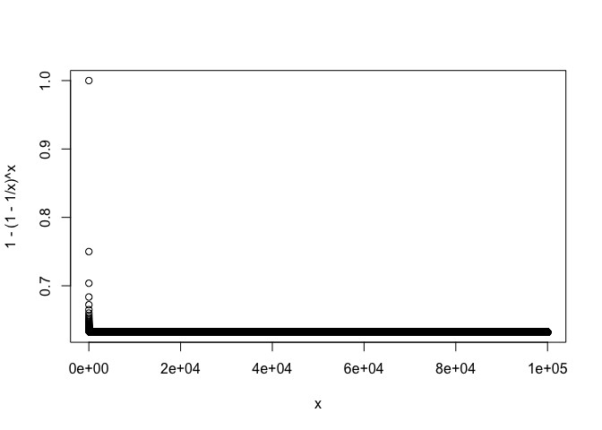

ex5.4
================

Conceptual - ex 5.4.2
---------------------

#### (a)

-   first boostrap observation `is not` the jth observation from the original sample.

<!-- -->

    => 1 - 1/n

#### (b)

-   second boostrap observation `is not` the jth observation from the original sample.

<!-- -->

    same as (a)
    => 1 - 1/n  

#### (c)

-   jth observation `is not` in the boostrap samples.

<!-- -->

    (1 - 1/n) x (1 - 1/n) x .... x (1 - 1/n) = (1 - 1/n)^n

#### (d)

-   when n=5, probability that the jth observation `is` in the bootstrap sample.

<!-- -->

    1 - (c) when n=5 
    => 1 - (1 - 1/n)^n => 1 - (1 - 1/5)^5 = 0.672

#### (e)

    same process as (d) when n=100
    => 1 - (1 - 1/100)^100 = 0.634

#### (f)

    # same process as (d) when n=10000
    => 1 - (1 - 1/10000)^10000 = 0.632

#### (g)

``` r
x = 1:100000
plot(x, 1 - (1 - 1/x)^x)
```



``` r
# => 0.632 에가깝게수렴
```

#### (h)

``` r
store = rep(NA, 10000)
for(i in 1:10000) {
  store[i] = sum(sample(1:100, rep=TRUE)==4) > 0 # 각 sample셋이 4를포함하는지 여부
}
mean(store)
```

    ## [1] 0.6317

    lim(1 + x/n)^n = e^x when n->inf.
    1 - e^(-1) = 0.632

Applied - ex 5.4.7
------------------

#### (a)

``` r
library(ISLR)
set.seed(1)
attach(Weekly)
glm.fits = glm(Direction~Lag1+Lag2, data = Weekly, family = binomial)
summary(glm.fits)
```

    ## 
    ## Call:
    ## glm(formula = Direction ~ Lag1 + Lag2, family = binomial, data = Weekly)
    ## 
    ## Deviance Residuals: 
    ##    Min      1Q  Median      3Q     Max  
    ## -1.623  -1.261   1.001   1.083   1.506  
    ## 
    ## Coefficients:
    ##             Estimate Std. Error z value Pr(>|z|)    
    ## (Intercept)  0.22122    0.06147   3.599 0.000319 ***
    ## Lag1        -0.03872    0.02622  -1.477 0.139672    
    ## Lag2         0.06025    0.02655   2.270 0.023232 *  
    ## ---
    ## Signif. codes:  0 '***' 0.001 '**' 0.01 '*' 0.05 '.' 0.1 ' ' 1
    ## 
    ## (Dispersion parameter for binomial family taken to be 1)
    ## 
    ##     Null deviance: 1496.2  on 1088  degrees of freedom
    ## Residual deviance: 1488.2  on 1086  degrees of freedom
    ## AIC: 1494.2
    ## 
    ## Number of Fisher Scoring iterations: 4

#### (b)

``` r
glm.fits.1 = glm(Direction~Lag1+Lag2, data = Weekly[-1,], family = binomial)
summary(glm.fits.1)
```

    ## 
    ## Call:
    ## glm(formula = Direction ~ Lag1 + Lag2, family = binomial, data = Weekly[-1, 
    ##     ])
    ## 
    ## Deviance Residuals: 
    ##     Min       1Q   Median       3Q      Max  
    ## -1.6258  -1.2617   0.9999   1.0819   1.5071  
    ## 
    ## Coefficients:
    ##             Estimate Std. Error z value Pr(>|z|)    
    ## (Intercept)  0.22324    0.06150   3.630 0.000283 ***
    ## Lag1        -0.03843    0.02622  -1.466 0.142683    
    ## Lag2         0.06085    0.02656   2.291 0.021971 *  
    ## ---
    ## Signif. codes:  0 '***' 0.001 '**' 0.01 '*' 0.05 '.' 0.1 ' ' 1
    ## 
    ## (Dispersion parameter for binomial family taken to be 1)
    ## 
    ##     Null deviance: 1494.6  on 1087  degrees of freedom
    ## Residual deviance: 1486.5  on 1085  degrees of freedom
    ## AIC: 1492.5
    ## 
    ## Number of Fisher Scoring iterations: 4

#### (c)

``` r
predict.glm(glm.fits.1, Weekly[1,], type="response") > 0.5
```

    ##    1 
    ## TRUE

``` r
Weekly[1,]$Direction
```

    ## [1] Down
    ## Levels: Down Up

``` r
# not correctly classified.
```

#### (d)

``` r
cnt = dim(Weekly)[1]
error <- rep(0, cnt)

for (i in 1:cnt) {
  glm.fit = glm(Direction~Lag1+Lag2, data = Weekly[-i,], family = binomial)
  
  pred.up = predict.glm(glm.fit, Weekly[i,], type="response") > 0.5
  true.up = Weekly[i,]$Direction == "Up"
  
  if(pred.up != true.up)
    error[i] <- 1
}

error
```

    ##    [1] 1 1 0 1 0 1 0 0 0 1 1 0 1 0 1 0 1 0 1 0 0 0 1 1 1 1 1 1 0 1 1 1 1 0
    ##   [35] 1 0 0 0 1 0 1 0 0 1 0 1 1 1 0 1 0 0 0 1 0 0 1 1 0 0 0 0 1 0 1 1 0 0
    ##   [69] 1 0 1 1 0 0 0 1 0 1 1 0 0 1 1 0 1 1 0 0 1 0 0 1 1 1 0 0 0 0 0 1 0 1
    ##  [103] 1 0 0 1 0 1 0 0 1 1 0 0 1 0 0 1 0 0 1 1 1 1 0 0 0 1 0 1 0 1 1 0 0 0
    ##  [137] 1 1 1 0 0 0 1 0 0 0 0 0 0 1 1 1 0 1 0 0 1 1 0 1 0 0 1 1 0 0 1 0 0 1
    ##  [171] 0 0 1 1 1 0 1 0 1 0 0 0 0 0 0 0 0 1 1 0 1 0 1 0 1 0 1 0 0 1 0 0 1 0
    ##  [205] 0 1 0 1 0 1 1 1 0 0 1 1 0 1 0 0 1 1 0 0 0 1 1 1 0 1 0 1 0 1 0 0 0 1
    ##  [239] 1 0 1 0 1 0 1 0 1 0 1 1 0 1 0 0 1 0 0 1 0 0 0 0 0 1 0 0 0 1 0 0 1 0
    ##  [273] 0 0 1 0 0 1 0 0 1 0 0 1 0 1 1 0 0 0 0 0 1 0 1 0 0 1 0 0 0 1 0 0 1 1
    ##  [307] 0 0 1 0 0 0 0 1 0 1 1 0 0 1 0 1 0 1 1 0 0 0 1 0 1 0 0 1 1 1 1 0 1 0
    ##  [341] 0 1 0 0 0 1 0 1 0 1 0 0 0 0 0 1 1 0 0 1 0 0 1 0 0 0 1 1 0 1 1 1 1 1
    ##  [375] 0 0 0 1 0 0 0 0 0 0 1 0 1 1 0 0 1 1 0 0 0 0 0 1 0 0 1 1 1 0 1 0 1 0
    ##  [409] 1 1 1 0 1 0 0 0 0 0 0 0 0 0 0 1 0 1 0 1 0 1 0 0 1 0 1 0 0 0 0 0 1 1
    ##  [443] 1 1 0 1 1 0 1 0 1 1 0 1 0 0 1 0 0 1 1 0 0 0 0 1 1 0 0 1 0 1 0 0 0 1
    ##  [477] 0 0 1 0 0 0 1 1 1 0 1 0 0 0 1 0 1 1 1 0 0 0 0 1 1 1 0 1 1 0 1 0 0 0
    ##  [511] 1 0 1 0 0 0 1 0 1 1 0 0 1 1 0 0 0 1 1 0 1 0 1 1 1 1 1 0 0 0 1 0 0 0
    ##  [545] 1 1 0 1 0 0 0 1 1 1 1 1 1 0 1 0 1 0 0 1 0 0 1 1 1 0 0 0 1 1 1 1 1 1
    ##  [579] 1 1 1 1 0 1 0 0 1 0 0 1 0 1 0 0 1 0 0 1 0 1 1 0 1 1 1 0 1 0 1 0 1 0
    ##  [613] 0 0 1 0 1 0 1 0 1 1 0 1 1 0 1 0 1 0 1 1 1 1 0 1 1 0 0 0 1 1 1 1 0 1
    ##  [647] 1 1 0 1 0 0 0 1 1 1 1 1 1 0 1 0 0 1 0 0 0 1 1 0 1 0 1 1 1 1 0 0 0 1
    ##  [681] 1 0 0 0 0 0 0 0 0 0 0 1 0 0 0 0 1 0 0 1 0 1 1 0 0 0 0 1 0 1 0 1 0 1
    ##  [715] 0 0 1 1 0 0 0 0 0 0 0 0 0 1 0 0 1 0 0 1 1 1 0 1 1 0 1 1 1 1 0 0 0 1
    ##  [749] 1 1 1 1 1 0 1 0 0 0 0 0 0 1 0 1 1 1 0 0 0 1 0 0 1 0 0 0 1 1 1 0 0 0
    ##  [783] 1 0 0 1 1 1 0 0 1 0 1 0 1 0 0 1 0 0 1 0 0 0 0 0 1 0 1 1 0 0 1 1 0 1
    ##  [817] 1 1 0 0 0 0 0 1 1 0 0 1 0 0 1 0 1 0 0 0 1 1 0 1 1 0 1 0 1 0 1 1 0 0
    ##  [851] 1 1 1 0 1 1 0 0 0 1 0 1 0 1 0 1 0 0 0 0 0 1 0 0 1 1 0 0 1 0 1 0 1 1
    ##  [885] 0 1 0 1 1 0 0 0 1 0 0 0 0 0 0 0 1 0 1 0 1 0 0 0 1 1 1 1 1 0 1 1 0 0
    ##  [919] 0 0 0 1 0 0 1 0 0 0 0 1 0 1 1 1 0 0 1 1 0 1 1 1 1 0 1 0 1 0 1 0 1 0
    ##  [953] 1 0 0 1 1 1 1 1 0 1 0 0 0 1 1 1 0 1 1 1 1 0 0 0 0 1 1 0 0 0 0 1 0 0
    ##  [987] 1 1 1 0 0 1 1 1 0 1 0 0 0 0 1 0 0 1 0 1 0 0 1 1 1 1 0 1 0 0 1 0 0 1
    ## [1021] 0 0 1 1 0 1 1 1 0 1 1 0 0 0 1 0 1 0 1 1 1 1 0 0 1 0 0 0 0 0 0 1 0 1
    ## [1055] 1 0 0 0 0 0 1 1 1 0 0 0 1 0 1 1 1 0 0 0 0 1 0 0 0 0 0 1 0 1 0 0 0 0
    ## [1089] 0

#### (e)

``` r
mean(error)
```

    ## [1] 0.4499541

``` r
# test error rate = 0.4499 (45%)
```
